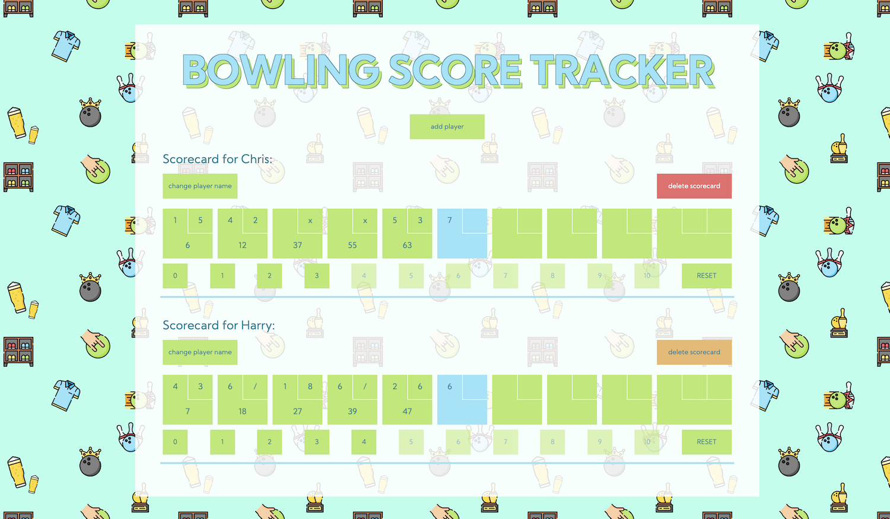

# 🎳 BOWLING SCORE CALCUATOR 🎳

## What is this?

This is a website that calculates bowling scores. The UI is written in react and the actual calculations and tests are written in pure Javscript, ES6, and can be found in a specific folder. This project was a great experience and challenge that I very much enjoyed. I decided to not make the site responsive, freeing up time for other tasks. I did not test the actual react components, since I'm fairly new to testing I wanted to focus on testing one part of the project and do my absolute best to do that as thoroughly as possible.

### Tech I used 🖥👩🏼‍💻⌨️

I looked at test challenges we did during the Technigo course, the file names in that repo where `.spec.js` instead of `.test.js`. When I googled it seemed as if spec includes a more non-technical explanation as well, but I'm still not 100% certain that I have understood the difference completely. I did however stick with `.spec.js`

I used styled-components 💅 for the styling, CSS-in-JS is my preferred styling choice for react and styled-components generates very clean looking components and a rather small stylesheet.

I used the `npx create-react-app` commando to set everything up and did my regular cleaning up of the files before starting.

### Information and/or tools I found valuable:

- [Google 🤪](https://www.google.com/)
- [How bowling score works](https://www.youtube.com/watch?v=aBe71sD8o8c)
- [Bowling score calculator - java](https://www.youtube.com/watch?v=OPGTPQ4kURU&ab_channel=TheCodeDojo)
- [Bowling score calculator - javascript](https://www.youtube.com/watch?v=brahHchaegc)
- [Repo from the course I attended this spring whith test challenges](https://github.com/Technigo/unit-tests)
- [Difference between specs and tests](https://stackoverflow.com/questions/16802030/whats-the-difference-between-tests-and-specs)
- [This is a pattern generator that I used for the background 🎳](https://www.flaticon.com/pattern/)

### Reflections and hiccups along the way

This was a challenging project, but it was also a lot of fun and I have learned quite a few things. I found the videos I have linked above very useful. When I started googling things like "bowling score tracker code" and similar search terms it didn't take long for me to come across bowling kata and a man called uncle Bob.

I have an array, **pinsDown**, that stores the users points from the button clicked, if the user scores a spare or strike a forward dash or an x is added, otherwise a numerical value converted to a string is added. Converting the numbers to strings is to make sure data types are not to mixed in that array is an active choice.

The main issue I had was not calculating the score for different types of rolls which is done in the BowlingGame class, but rather displaying the correct number, sign or empty string for said roll. In the button component that logic is handled. I have tried my absolute best to extract logic from the main function to smaller functions, and dito to refactor the code. However there are quite a few specific conditions to take in to account and therefore I ended up with a couple of `if else`-statements.

Overall I'm pretty satisfied with what I have done, I've tried my best to give clear names to variables, methods and functions and also keeping the code clean. I would like to learn how to test the actual components in react and I will definitely continue to dive into TDD as the benefits seem huge.

If you have read all this, I will finish by saying thank you ✌️

### Check it out 👀

**Clone it and:**
`npm install` => `npm start`

**or view it live:**
[Bowling score calculator](https://bowling-score-calculator.netlify.app/)
